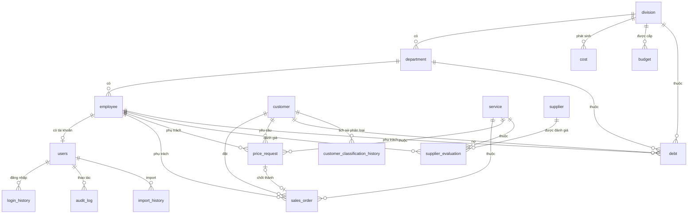

# ERD — Dashboard LACCO (bản thảo bước 2.1)

**Trạng thái:** Bản thảo — chờ `db-schema-agent` review & COO xác nhận trước khi sang bước 2.2 (sinh SQLAlchemy models). | **Ngày:** 17/08/2026 | **Nguồn:** 12/14 yêu cầu "Đã rõ" trong `Bieu_mau_Yeu_cau_va_RACI_LACCO.xlsx` + `.claude/rules/trang-thai-yeu-cau.md` + CLAUDE.md (RBAC, Audit, LoginHistory bắt buộc).

## Nguyên tắc thiết kế

- Chỉ tạo bảng cho 12 yêu cầu đã "Đã rõ". **Không tạo bảng cho CRM và Dòng tiền** (đã chốt dời Giai đoạn 2) — đúng nguyên tắc trong `.claude/rules/trang-thai-yeu-cau.md`.
- Tên bảng/cột bằng tiếng Anh, snake_case (theo CLAUDE.md mục 4).
- Mỗi bảng khoá ngoại (FK) đều nên có index — sẽ nhắc `db-schema-agent` áp dụng khi sinh model ở bước 2.2.
- Đây là thiết kế cho MVP Giai đoạn 1 — ưu tiên đủ dùng và dễ đọc lại, không tối ưu quá sớm (đúng nguyên tắc CLAUDE.md mục 1: không có đội dev backup).

## Nhóm bảng danh mục (dimension)

| Bảng | Mục đích | Cột chính |
|---|---|---|
| `division` (Khối) | Cấp cao nhất trong RBAC theo Khối/Phòng | `id`, `name` |
| `department` (Phòng) | Thuộc 1 `division` | `id`, `name`, `division_id` (FK) |
| `employee` (Nhân viên) | Thuộc 1 `department`; có nhóm nhân sự cho báo cáo Chi phí theo Nhóm | `id`, `full_name`, `department_id` (FK), `staff_group` (enum: LĐ/QL/Frontline/Middle/Backend), `position`, `is_active` |
| `service` (Dịch vụ) | VD: Cước, Hải quan... | `id`, `name` |
| `customer` (Khách hàng) | Trạng thái phân loại **hiện tại** — lịch sử biến động nằm ở bảng riêng bên dưới | `id`, `code`, `name`, `source` (Nguồn KH), `current_classification` (A/B/C), `created_at` |
| `supplier` (Nhà cung cấp) | Dùng cho báo cáo Pricing – Nhà cung cấp | `id`, `name` |

## Nhóm bảng nghiệp vụ (fact)

| Bảng | Phục vụ báo cáo | Cột chính |
|---|---|---|
| `sales_order` (Đơn hàng) | Doanh thu theo dịch vụ/KH/Khối-Phòng-NV, Tình trạng đơn hàng, Tình trạng xuất hóa đơn | `id`, `customer_id` FK, `service_id` FK, `employee_id` FK (NV kinh doanh), `order_date`, `status`, `revenue`, `order_cost`, `invoice_status`, `invoice_date` |
| `price_request` (Yêu cầu báo giá) | Pricing – Thành đơn (= số chốt đơn / số request) | `id`, `service_id` FK, `employee_id` FK (NV Pricing), `customer_id` FK (nullable — xem mục cần xác nhận #7), `request_date`, `is_won`, `sales_order_id` FK (nullable, điền khi chốt đơn) |
| `supplier_evaluation` | Pricing – Nhà cung cấp | `id`, `supplier_id` FK, `service_id` FK, `employee_id` FK (người đánh giá), `period`, `score`, `notes` |
| `cost` (Chi phí theo Khối) | Chi phí theo Khối, nguồn AMIS | `id`, `division_id` FK, `period`, `amount` |
| `budget` (Ngân sách theo Khối) | So sánh chi thực tế vs ngân sách | `id`, `division_id` FK, `period`, `amount` |
| `personnel_cost` (Chi phí theo Nhóm) | Chi phí theo Nhóm LĐ/QL/Frontline/Middle/Backend, nguồn AMIS (đã nhóm sẵn) | `id`, `staff_group`, `period`, `amount` |
| `debt` (Công nợ) | Công nợ Khối→Phòng→KD, ngưỡng quá hạn 4 mức | `id`, `customer_id` FK, `division_id` FK, `department_id` FK, `employee_id` FK, `invoice_date`, `due_date`, `amount`, `aging_bucket` (tính từ `due_date`: 0-30/31-60/61-90/>90 ngày) |
| `customer_classification_history` | Tăng giảm loại KH A/B/C theo thời gian | `id`, `customer_id` FK, `classification` (A/B/C), `snapshot_date` |

**Vì sao có `customer_classification_history` riêng:** câu hỏi nghiệp vụ gốc là "Cơ cấu khách hàng theo hạng đang dịch chuyển **thế nào**" — cần dữ liệu theo thời gian, không chỉ trạng thái hiện tại. Bảng này ghi lại 1 dòng mỗi lần import dữ liệu mới, để dựng biểu đồ xu hướng A/B/C theo tháng/quý.

**Vì sao tách `price_request` khỏi `sales_order`:** công thức "Thành đơn" = số lượng chốt đơn / số lượng request giá — nếu gộp chung 1 bảng sẽ không đếm được mẫu số (tổng số yêu cầu báo giá, kể cả những yêu cầu không thành đơn).

**Vì sao đổi tên bảng đơn hàng thành `sales_order` (không đặt là `order`):** `ORDER` là từ khoá dành riêng (reserved keyword) trong MySQL 8.0 (dùng cho `ORDER BY`) — đặt tên bảng trùng từ khoá buộc phải escape bằng backtick ở mọi truy vấn, dễ gây lỗi khi sinh SQLAlchemy model ở bước 2.2. Đổi sang `sales_order` để tránh rủi ro này, không đổi ý nghĩa nghiệp vụ. Đồng thời đổi cột `cost` trên bảng này thành `order_cost` để không trùng tên với bảng `cost` (Chi phí theo Khối) — tránh nhầm lẫn giữa "giá vốn của 1 đơn hàng" và "chi phí toàn Khối theo kỳ".

## Nhóm bảng bảo mật/audit (bắt buộc theo CLAUDE.md mục 6)

| Bảng | Mục đích |
|---|---|
| `users` | Tài khoản đăng nhập — `id`, `username`, `password_hash` (bcrypt), `role` (Admin/Manager/User), `employee_id` FK (nullable), `is_active` |
| `login_history` | Mọi phiên đăng nhập — `id`, `user_id` FK, `login_at`, `ip_address`, `success` |
| `audit_log` | Mọi thay đổi dữ liệu — `id`, `user_id` FK, `action`, `table_name`, `record_id`, `changed_at`, `old_value`, `new_value` |
| `import_history` | Lịch sử import Excel/CSV (dùng ở bước 2.4) — `id`, `imported_by` FK → `users`, `file_name`, `import_type`, `row_count`, `error_count`, `imported_at`, `status` |

## Sơ đồ quan hệ (Mermaid ERD)

## Việc cần xác nhận trước khi sang bước 2.2 (chưa đủ dữ liệu để tự quyết)

*(Cập nhật 22/08/2026: mục #4 — rủi ro cao nhất — và mục #10 (thang điểm `score`) đã được COO xác nhận, xem chi tiết bên dưới. Còn 8/10 mục mở, không mục nào chặn tiến độ, có thể vừa code vừa chốt dần.)*

1. **Danh sách giá trị cụ thể của `sales_order.status`** — RACI ghi "Cần xác nhận danh sách trạng thái cụ thể trong hệ thống FT" dù dòng này đã "Đã rõ" ở mức khái niệm. Cần Trưởng phòng Vận hành cung cấp danh sách enum thật (VD: Mới tạo, Đang xử lý, Đang vận chuyển, Đã giao, Huỷ...).
2. **`invoice_status`** tương tự — là 1 giá trị trong cùng quy trình trạng thái đơn hàng hay là field độc lập? Thiết kế hiện tại giả định là field riêng trên `sales_order` cho đơn giản — cần xác nhận có đúng không.
3. **Tần suất snapshot `customer_classification_history`** — mỗi lần import dữ liệu (hàng tháng theo tần suất báo cáo Khách hàng) hay cần tần suất khác?
4. ~~**Giả định mã khoá dùng chung giữa FT và AMIS**~~ — **Đã xác nhận (22/08/2026, COO):** FT và AMIS dùng chung một bộ mã Khối/Phòng/Nhân viên/Khách hàng. Thiết kế FK trực tiếp hiện tại (`cost`, `budget`, `personnel_cost`, `debt` tham chiếu thẳng sang `division`, `department`, `employee`, `customer`) là đúng, **không cần bảng mapping trung gian**. Không cần sửa gì ở bước 2.2 cho mục này.
5. **`debt` lưu đồng thời cả `division_id` và `department_id`** (department vốn đã có `division_id` riêng) — đây là thiết kế suy luận để truy vấn nhanh theo phân cấp Khối→Phòng→KD mà không cần join, không phải yêu cầu tường minh từ phỏng vấn. Cần xác nhận: có chấp nhận rủi ro 2 cột lệch nhau (department không thuộc đúng division) không, hay nên bỏ `division_id` và suy ra qua `department.division_id` khi truy vấn?
6. **`debt.aging_bucket`** (0-30/31-60/61-90/>90 ngày) — cột này tính từ `due_date` so với ngày hiện tại, nghĩa là giá trị đúng của một dòng dữ liệu **thay đổi theo từng ngày** dù dữ liệu gốc không đổi. Nếu lưu vật lý trong DB thì sẽ lỗi thời (stale) trừ khi có job tính lại mỗi ngày; nếu tính động thì theo nguyên tắc tách lớp ở CLAUDE.md mục 2 (logic không nằm trong `src/db/`), việc này nên nằm ở `src/services/` tại thời điểm truy vấn, không nên là cột vật lý. **Cần xác nhận với COO:** báo cáo Công nợ cần xem theo "hiện trạng tại thời điểm xem" hay "snapshot tại thời điểm import" — quyết định này ảnh hưởng có nên giữ cột này trong bảng `debt` hay không.
7. **`price_request.customer_id` nullable — vì sao và có chồng phạm vi CRM không?** Giả định hiện tại: cho phép null khi báo giá cho khách hàng tiềm năng chưa có trong `customer` (chưa từng phát sinh đơn). Đây là suy luận, chưa có trong phỏng vấn nghiệp vụ. Cần xác nhận có đúng lý do này không — và nếu đúng, cần lưu ý ranh giới: KHÔNG mở rộng bảng này thành nơi lưu thông tin lead/khách hàng tiềm năng (đó là phạm vi CRM, đã chốt dời Giai đoạn 2).
8. **Enum chưa liệt kê giá trị cụ thể:** `import_history.status` (VD: success/partial/failed?) và `audit_log.action` (VD: create/update/delete?) — chưa có trong yêu cầu nghiệp vụ vì đây là bảng kỹ thuật/audit, không thuộc 14 dòng RACI, nhưng vẫn cần chốt danh sách giá trị cụ thể trước khi sinh SQLAlchemy Enum ở bước 2.2 để tránh tự đoán.
9. **`users.employee_id` nullable** — giả định lý do: có tài khoản hệ thống (VD: Admin kỹ thuật) không gắn với 1 nhân viên nghiệp vụ cụ thể trong bảng `employee`. Cần COO xác nhận giả định này đúng, hoặc mọi tài khoản đều bắt buộc gắn nhân viên (khi đó bỏ nullable).
10. ~~**`supplier_evaluation.score` — thang điểm 0–100 hay 1–5?**~~ — **Đã xác nhận (22/08/2026, COO):** giữ thang điểm **0–100**, đúng như giả định mặc định `data-import-agent` đã dùng để viết Pandera schema (`src/services/import_schemas/business_schemas.py`). Không cần sửa gì thêm ở schema hay code — mục này chính thức đóng.

    *(Lịch sử: phát sinh ở bước 2.2 khi sinh model với kiểu `Numeric(5,2)` — đủ chứa cả 2 thang nên không chặn bước 2.3. Đến bước 2.4, `data-import-agent` tạm chọn 0–100 làm mặc định để viết được Pandera Check, có ghi chú rõ là giả định chờ xác nhận. COO xác nhận chính thức giữ nguyên 0–100 khi review bước 2.4.)*

## Cập nhật sau bước 2.2 (sinh SQLAlchemy models) — 22/08/2026

Khi sinh code model tại `src/db/models/`, phát sinh thêm 2 quyết định kỹ thuật ngoài 9 mục ERD gốc:

- **`period` (trên `cost`, `budget`, `personnel_cost`, `supplier_evaluation`) chọn kiểu `Date`**, quy ước lưu ngày đại diện đầu kỳ — **chấp nhận làm mặc định**, không cần COO xác nhận thêm: đây là lựa chọn kỹ thuật thuần tuý, không đổi ý nghĩa nghiệp vụ, và không phá schema nếu sau này lộ ra tần suất thật khác tháng (vẫn dùng `Date`, chỉ đổi cách truy vấn nhóm theo tuần/quý ở `src/services/`).
- **`supplier_evaluation.score` dùng `Numeric(5,2)`** — đủ chứa cả thang điểm 0–100 lẫn 1–5 (không cần đổi schema dù chọn thang nào), nhưng **chưa rõ thang điểm thật** — thêm vào danh sách "cần xác nhận" thành **mục #10** bên dưới, không chặn bước 2.3.
- Agent tự thêm `unique=True` cho `service.name`, `customer.code`, `users.username` — ràng buộc kỹ thuật hợp lý (các giá trị này về bản chất phải duy nhất), **chấp nhận**, không phải thay đổi cấu trúc bảng/cột.

## Không nằm trong phạm vi bước 2.1 (để bước sau)

- Sinh code SQLAlchemy models thật — bước 2.2.
- Alembic migration — bước 2.3.
- RBAC thật (map `role` + `current_classification` thành quyền truy vấn cụ thể) — Tuần 3, bước 3.1.
